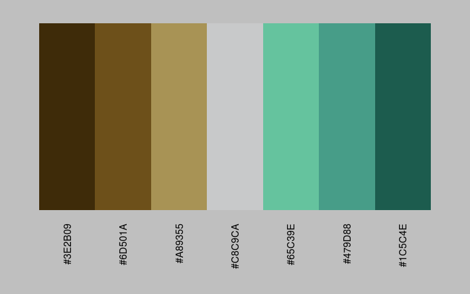
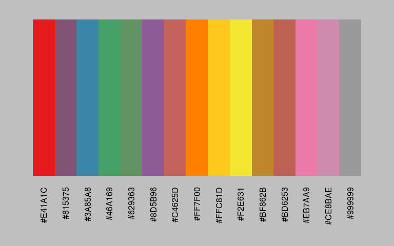
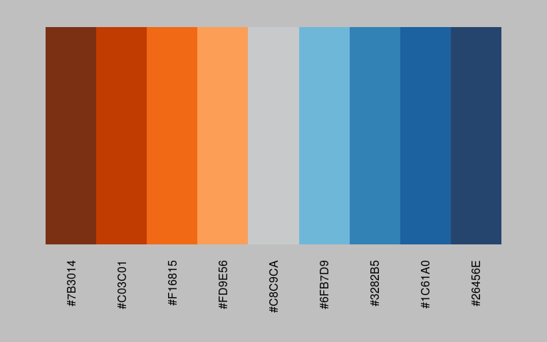
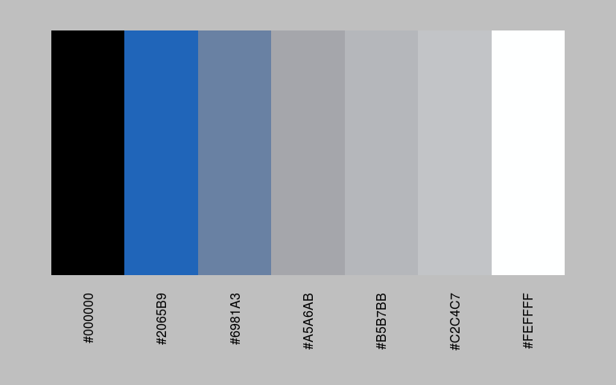
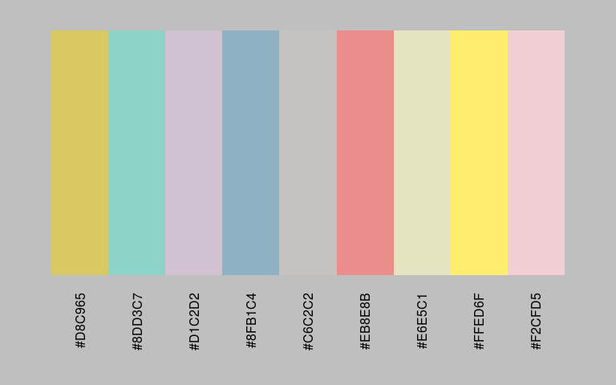

colourgen
================

-   [Install](#install)
-   [Basic Functionality](#basic-functionality)
-   [No Limitations](#no-limitations)
-   [COLOURLovers API](#colourlovers-api)
-   [Other Options](#other-options)
-   [Summary](#summary)

### Install

Install using `devtools::install_github("onehundredpercenttexan/colourgen")`

### Basic Functionality

The `colourgen` package provides a single, consistent interface for generating colour palettes in R. The `colourgen::make_palette` function returns a list object containing a base graphics `plot` preview and `palette` character vector which make generating, inspecting and fine-tuning color palettes a breeze.

The `colour` parameter will accept any base R color function, `RColorBrewer` named palette, `viridis` named palette or variable-length character vector of any combination of base `grDevices::colours` and hexadecimal colors.

There aren't enough good diverging palettes so `colourgen::make_palette` will default some right out-of-the box.

`colourgen::make_palette()`

    ## Empty or Unknown Colour(s)... 
    ##   Defaulting to Tableau-esque 
    ##   Orange-Blue Diverging Palette


``` r
my_palette <- colourgen::make_palette(default = FALSE)
```

    ## Empty or Unknown Colour(s)... 
    ##   Defaulting to Stephen Few-esque 
    ##   Earth-Emerald Diverging Palette



If you like tweaking your color palettes, you can easily do that. Let's just simply replace the middle color with "ivory" and call `colourgen::make_palette` again to check the new results.

``` r
my_palette$palette
```

    ## [1] "#3E2B09" "#6D501A" "#A89355" "#C8C9CA" "#65C39E" "#479D88" "#1C5C4E"

``` r
my_palette$palette[4] <- "ivory"
my_palette_redo <- colourgen::make_palette(colour = my_palette$palette)
```


### No Limitations

If you want to interpolate a palette that normally has a hard limit; don't worry, `colourgen` was created for this very reason and wil return as many colors as you need for your factor levels! *NOTE:, you should still be careful and use common sense ;)*

`colourgen::make_palette("set1", n = 15)`



### COLOURLovers API

`colourgen` also supports the [COLOURLovers](http://www.colourlovers.com/palettes) palette API. Just supply a valid paletteID and you can interpolate over that palette 'til your heart's content.

`colourgen::make_palette(colour = 3914747, n = 9)`

    ## Empty or Unknown Colour(s)... 
    ##   Defaulting to Tableau-esque 
    ##   Orange-Blue Diverging Palette



### Other Options

`colourgen` will let you shuffle or reverse the returned palette if you need to.

`colourgen::make_palette(colour = "set3", n = 9, shuffle = TRUE)`



`colourgen::make_palette(colour = "Purples", n = 15, reverse = TRUE)`



### Summary

`colourgen` aims to be a simple, but effective solution to the common task of crafting and previewing color palettes from many diverse sources. I hope you find it useful and also feel free to make pull/merge requests for bugs and improvements or adding new features if you like.
