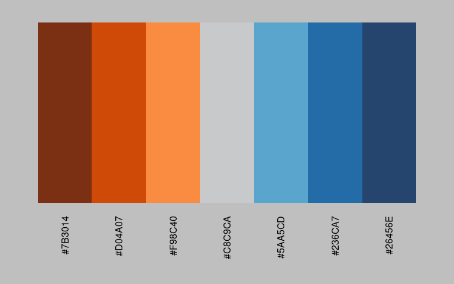
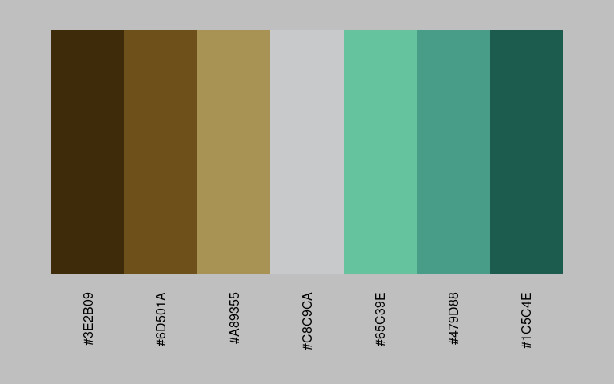
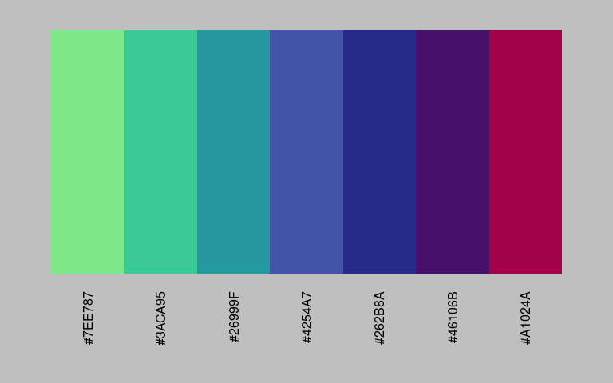
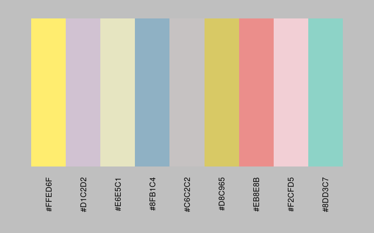
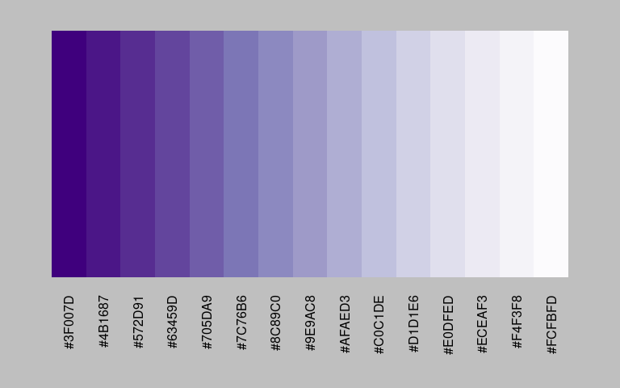

colourgen
================

- [Install](#install)
- [No Limitations](#no-limitations)
- [COLOURLovers API](#colourlovers-api)
- [Image Sampling](#image-sampling)
- [Other Options](#other-options)
- [Summary](#summary)

### Install

Install using `devtools::install_github("cjtexas/colourgen")`

The `colourgen` package provides a single, simple interface for
generating colour palettes in R. `colourgen::make_palette` is the main
function and returns a `colourgen` object with very handy `plot` and
`print` methods to make generating, inspecting and fine-tuning color
palettes a breeze.

The `colour` parameter will accept any base R color function,
`RColorBrewer` named palette, `viridis` named palette,
[COLOURLovers](https://www.colourlovers.com/palettes) palette ID or
variable-length character vector of any combination of base
`grDevices::colours` and/or hexadecimal colors.

At the time I created this package there weren’t enough good diverging
palettes and I tend to use them alot in my work, so `colourgen` will
default to some right out-of-the box.

`colourgen::make_palette()`

    ## Empty or Unknown Colour(s)... 
    ##   Defaulting to Tableau-style 
    ##   Orange-Blue Diverging Palette

<!-- -->

``` r
my_palette <- colourgen::make_palette(default = FALSE)
```

    ## Empty or Unknown Colour(s)... 
    ##   Defaulting to Stephen Few-style 
    ##   Earth-Emerald Diverging Palette

``` r
plot(my_palette)
```

<!-- -->

If you like tweaking your color palettes, you can easily do that. Let’s
just simply replace the middle color with “ivory” and call
`colourgen::make_palette` again to check the new results.

``` r
my_palette[4] <- "ivory"
my_palette_mod <- colourgen::make_palette(colour = my_palette)
plot(my_palette_mod)
```

<!-- -->

### No Limitations

If you want to interpolate a palette that normally has a hard limit;
don’t worry, `colourgen` was created for this very reason and wil return
as many colors as you need for your factor levels! *NOTE:, you should
still be careful and use common sense ;)*

`colourgen::make_palette(colour = "set1", n = 15)`

<!-- -->

### COLOURLovers API

`colourgen` also supports the
[COLOURLovers](http://www.colourlovers.com/palettes) palette API. Just
supply a valid paletteID and you can interpolate over that palette ’til
your heart’s content.

`colourgen::make_palette(colour = 3914747, n = 9)`

<!-- -->

### Image Sampling

`colourgen` will also accept an image path or url. For example, let’s
make a palette from the R logo!

`colourgen::make_palette(colour = "http://r-project.org/Rlogo.png", n = 7)`

<!-- -->

### Other Options

`colourgen` will let you shuffle or reverse the returned palette if you
need to.

`colourgen::make_palette(colour = "set3", n = 9, shuffle = TRUE)`

<!-- -->

`colourgen::make_palette(colour = "Purples", n = 15, reverse = TRUE)`

<!-- -->

### Summary

`colourgen` aims to be a simple, but effective solution to the common
task of crafting and previewing color palettes from many diverse
sources. I hope you find it useful and also feel free to make pull/merge
requests for bugs and improvements or adding new features if you like.
